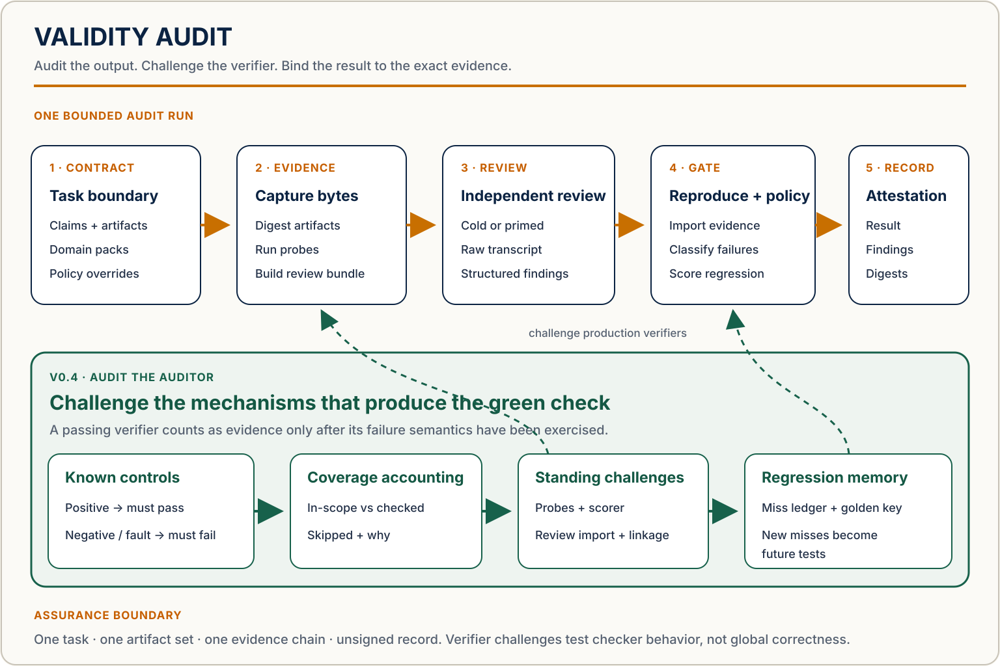

# Validity Audit

**A self-falsification protocol and reference runtime for bounded, evidence-backed claims about
agent-produced work.**

Validity Audit does not certify an agent, model, organization, or workflow globally. It produces an
**unsigned validity attestation for one task run over one digest-bound artifact set**. The record
says what was claimed, what evidence was reviewed, what reproduced findings triggered policy, and
which exact bytes the result covers.

The project exists because static evaluators decay. Builders miss their own assumptions; reviewers
can hallucinate findings; public benchmarks get optimized against. Validity Audit combines
independent review, reproduction gates, an accreting miss ledger, and public-key regression tests so
the evaluator can be challenged too.

> **Maturity:** v0.3.0 is the latest released line; master is v0.4 development. The v0.3 CLI path
> below is implemented and tested. Current v0.4 work is extending how verifiers themselves are
> challenged; signing, provider adapters, API-key installation, and global agent certification are
> not available.

## Quickstart: reproduce the public golden case

These are the same install and execution commands used by the offline CI job:

```console
python -m pip install -e .
python golden_cases/self_contained/doc-bundle-01/run_case.py
```

The second command runs `prepare` and `finalize`, verifies the complete unsigned attestation, and
scores the imported reviewer fixture against a frozen key. Its final line is:

```text
Golden case PASS: expected fail attestation and 1/1 regression score reproduced
```

The apparent contrast is intentional: the audit correctly returns a blocking `fail` for the planted
artifact defect, while the benchmark passes because that expected finding was reproduced. The case
uses no API key; CI also blocks outbound socket access during execution.

## Run one audit

Create a JSON task contract that names one task, its bounded claims, repository-relative artifacts,
domain packs, and any reason-bearing policy overrides. See
[`schemas/examples/task_contract.json`](schemas/examples/task_contract.json) for a minimal example.
Then prepare a fresh run directory:

```console
validity-audit prepare \
  --workspace . \
  --contract path/to/task_contract.json \
  --run-dir .validity-audit/runs/my-run \
  --review-context cold \
  --reviewer-kind human \
  --reviewer-label independent-reviewer \
  --operator-id local-operator
```

Give the emitted `review_bundle.json`—not the answer key or miss ledger—to an independent reviewer.
Retain the raw transcript and collect JSON that validates against
[`schemas/reviewer_output.schema.json`](schemas/reviewer_output.schema.json). Then finalize:

```console
validity-audit finalize \
  --workspace . \
  --run-dir .validity-audit/runs/my-run \
  --reviewer-output path/to/reviewer_output.json \
  --transcript path/to/raw_transcript.txt
```

`prepare` validates the contract, snapshots the exact artifact bytes, computes the digest chain,
runs deterministic probes, and emits the provider-neutral review bundle. `finalize` refuses changed
evidence, retains the raw transcript, imports findings without trusting reviewer-supplied policy
results, applies the versioned policy, and writes:

- `attestation.json` — machine-readable unsigned attestation;
- `attestation.md` — human-readable report;
- `run_state.json` — durable lifecycle and evidence digests;
- an optional canonical receipt in `.validity-audit/attestations.jsonl`.

Every `prepare` requires a new or empty `--run-dir`. Equal inputs, ids, and timestamps produce equal
digests in separate fresh directories; an existing evidence directory is never overwritten.

### Exit-code contract

| Code | Meaning |
|---:|---|
| `0` | prepare succeeded, or finalize produced `pass` / `pass_with_waiver` |
| `1` | invalid arguments, invalid input, or another operational error |
| `2` | finalize emitted a blocking `fail` attestation |
| `3` | finalize emitted a `needs_review` attestation |
| `4` | digest or provenance mismatch; no attestation emitted |

## What the output looks like

The human-readable report is deliberately short:

```markdown
# Unsigned Validity Attestation

- Task: `golden-doc-bundle-01`
- Status: **fail**
- Policy: `validity-audit-default-v0.3.0`

## Findings

- `incorrect-artifact-count` — **fail** — Details file overstates the audited artifact count

> This v0.3 record is unsigned. It covers one task run and one artifact set;
> it does not certify an agent globally.
```

See the complete, schema-valid
[`docs/attestation-example.json`](docs/attestation-example.json). Its artifact, contract, review
bundle, and transcript digests are real and reproduced by CI.

## Architecture: five assurance layers



The layers are assurance responsibilities, not five Python packages:

| Layer | Responsibility | v0.3 implementation |
|---|---|---|
| 1. Contract | Bound one task, claims, artifact set, packs, and overrides | versioned task-contract schema |
| 2. Evidence | Snapshot bytes, compute digests, run deterministic probes | artifact manifest, probe report, review bundle |
| 3. Independent review | Separate builder from reviewer and retain what the reviewer saw | cold/primed context, provider-neutral import, raw transcript |
| 4. Reproduction and policy | Distinguish suspicion from reproduced failure | four finding axes, error-class gates, waivers |
| 5. Audit record | Bind the outcome to one run and artifact set | JSON/Markdown attestation plus receipt ledger |

The digest chain covers the task contract, every artifact, the canonical artifact manifest, probe
report, review bundle, raw transcript, and final attestation. Changing an artifact voids the
record for the changed bytes. The optional receipt ledger (`.validity-audit/attestations.jsonl`)
holds the attestation SHA-256 but is itself a mutable append-only file and is not part of the
digest chain.

## Three adoption modes

| Adoption mode | Maturity | What exists now |
|---|---|---|
| End-to-end repository / CLI | **Available** | install the package; run `prepare` and `finalize`; reproduce the public golden case |
| Plugin or agent skill | **Partial / downstream** | the Claude Code skill applies this public protocol, but plugin distribution is maintained outside this repository |
| Embedded API/model integration using the user's key | **Future** | no provider adapters, API-key management, or direct model invocation in v0.3 |

This repository is the canonical protocol upstream. Downstream skills or plugins should sync from
it rather than silently becoming a second source of truth.

## Cold evaluation versus public-key regression

These are different claims and must remain visibly separate:

| Evaluation | Reviewer receives | What it can support |
|---|---|---|
| Cold review | task, claims, and artifacts only; no key, hints, or miss ledger | bounded evidence about first-pass discovery, if contamination controls and denominator are documented |
| Primed review | declared hints or prior findings | targeted coverage and deeper follow-up, not independent cold performance |
| Public-key regression | checked-in target and frozen expected findings | whether a protocol revision lost known catches; not new cold recall |

The public `doc-bundle-01` score is regression evidence. The checked-in reviewer output is a
deterministic primed fixture, not model-performance evidence. The historical `~2.5/6` v1 figure was
a retrospective structural-ceiling estimate; the historical `5/6` v2 figure was measured before
that key became public. Future runs on that public key are regression runs.

## Default error-class policy

Policy is versioned as `validity-audit-default-v0.3.0` and is the sole writer of `gate_effect`.

| Reproduced error class | Default gate effect |
|---|---|
| `correctness` | `fail` |
| `evidence_tampering` | `fail` |
| `fabrication` | `fail` |
| `leakage` | `fail` |
| `material_requirement_miss` | `fail` |
| `unauthorized_action` | `fail` |
| `fitness` | `advisory` |
| `maintainability` | `advisory` |
| `other` or an unclassified open slug | `none`; overall result becomes `needs_review` |

A reason-bearing task-contract override can explicitly classify a slug as `fail`, `advisory`, or
`none`. A non-reproduced fail-class suspicion routes to `needs_review`. A waiver can change an active
reproduced fail result only when it records issuer, reason, issue time, expiry, and the original
policy result; it never erases the underlying finding.

## Threat model and honest limits

Validity Audit is designed to expose false or unsupported claims, missed material requirements,
hidden operational risks, and true-but-unfit outputs. It reduces several failure modes but does not
eliminate them:

- **Unsigned record:** `signature` is required to be `null`; reviewer and operator labels are
  descriptive, not authenticated identities or non-repudiation.
- **Bounded assurance:** one attestation covers one task run and artifact set. Linked run ids do not
  create a workflow certificate, and a passing run does not certify an agent globally.
- **Reviewer limits:** a reviewer can still miss defects, share the builder's blind spots, or be
  contaminated by prior context. Transcript and bundle digests record evidence boundaries but do
  not prove the reviewer followed them. Reviewer-controlled `finding.title` values are neutralised
  to literal text in `attestation.md` (inline CommonMark punctuation backslash-escaped; line
  separators collapsed to a space); they cannot form clickable links, images, or raw HTML.
- **Operator honesty:** transcript retention makes later comparison possible but cannot prevent an
  operator from withholding relevant material before it enters the run.
- **Public-key overfitting:** published keys measure regression and are vulnerable to optimization.
  Cold-performance claims require never-published material, a defined corpus and scorer, false
  positives, and contamination controls.
- **Small deterministic floor:** current probes check artifact readability and relative Markdown
  links; the injected benchmark deliberately shows 0/5 reasoning-level coverage.
- **No provider execution:** v0.3 generates and imports review material but does not call a model,
  manage API keys, sandbox reviewers, or guarantee model-family independence.
- **No signing or supply-chain identity:** artifact digests detect byte mismatch; they do not attest
  who created the artifact, who ran the audit, or whether the runner itself was trustworthy.
- **No multi-file crash transaction:** evidence files are atomic and ledger duplicates are
  preflighted, but v0.3 does not claim transactional rollback across every output.

## Audit the auditor

Validity Audit currently uses two shipped feedback mechanisms and one v0.4 development contract:

1. **Miss-ledger coevolution:** every verified miss becomes a replayable challenge for the next run.
2. **Golden-case regression:** after a protocol change, replay frozen public findings and report
   misses and unexpected findings. Unexpected findings require adjudication; a key change creates a
   new immutable version.
3. **Verifier challenges (v0.4 development):** home-grown checks should prove that they can pass a
   known-good input, fail a known-bad input, and fail closed when the checker itself breaks. The
   current protocol contract is documented in
   [`protocol/VERIFIER_CHALLENGES.md`](protocol/VERIFIER_CHALLENGES.md); standing runtime/CI coverage
   will be added only when it is implemented and exercised.

The planted deterministic-floor benchmark makes the current lower boundary explicit:

| Class | Caught | False alarms / clean cases |
|---|---:|---:|
| Mechanical planted defects | 6/6 | 0/6 |
| Reasoning-level planted defects | 0/5 | — |
| Overall deterministic floor | 6/11 | — |

That is a reason to require independent review, not a claim that the evaluator is complete.

## Compatibility window

The canonical v0.3 paths and their legacy launchers are:

| Legacy path | Canonical replacement | Support window |
|---|---|---|
| `protocol/injected_bug_recall.py` | `benchmarks/injected/run.py` | retained through all v0.3.x releases; earliest removal v0.4.0 |
| `examples/self_contained/run_demo.py` | `golden_cases/self_contained/doc-bundle-01/run_case.py` | retained through all v0.3.x releases; earliest removal v0.4.0 |
| `protocol/ledger.py` | `validity-audit-ledger` or `validity_audit/ledger.py` | retained through all v0.3.x releases; earliest removal v0.4.0 |

Any removal requires a changelog entry and migration note; v0.3 compatibility behavior is tested in
CI.

## Repository map

| Path | Purpose |
|---|---|
| [`validity_audit/`](validity_audit/) | reference runtime, policy, probes, schemas, digests, and ledger |
| [`schemas/`](schemas/) | public JSON Schemas, examples, and canonicalization rules |
| [`domains/`](domains/) | checklist packs and three-tier threat model |
| [`benchmarks/`](benchmarks/) | injected deterministic floor, public-key scorer, and offline guard |
| [`golden_cases/`](golden_cases/) | historical public keys and the runnable self-contained case |
| [`protocol/`](protocol/) | protocol design, coevolution, verifier challenges, meta-audit, and compatibility shims |
| [`docs/`](docs/) | architecture and worked attestation artifacts |

## Roadmap

v0.3.0 was released on 2026-07-30. `master` now represents v0.4 development rather than an
unreleased v0.3 release candidate.

The near-term v0.4 direction is to turn verifier challenges from a protocol rule into durable,
executable evidence where it adds real assurance. The first targets are home-grown checks and
wrappers whose exit-code handling, skip behavior, or evidence filtering can turn checker failure into
a false pass. This work must preserve the distinction between **checking the checker** and proving
that the checked property is the right property for the task.

Other later candidates include:

- signed attestations and verification with explicit identity semantics;
- provider adapters and user-controlled API-key integrations;
- pack discovery and compatibility validation;
- protected never-published cold corpora and contamination controls;
- cross-case regression reporting without double-counting aliases;
- stronger transactional and supply-chain guarantees.

No roadmap item is presented as available until it ships and is exercised by CI.

## Origin

The protocol was distilled from audits of quant backtests, generative systems, educational content
pipelines, deployed prediction systems, and internal rule sets. It first appeared inside
[relationship-validity-monitor](https://github.com/klmtseng/relationship-validity-monitor) and
became a standalone project when the failure pattern generalized beyond finance.

See [`protocol/COEVOLUTION.md`](protocol/COEVOLUTION.md) for the miss-ledger design,
[`protocol/META_AUDIT.md`](protocol/META_AUDIT.md) for the framework's own audit,
[`protocol/VERIFIER_CHALLENGES.md`](protocol/VERIFIER_CHALLENGES.md) for the v0.4 verifier contract,
and [`golden_cases/README.md`](golden_cases/README.md) for public-key provenance.

---

MIT License. This is research and engineering infrastructure, not investment, legal, safety, or
compliance advice.
