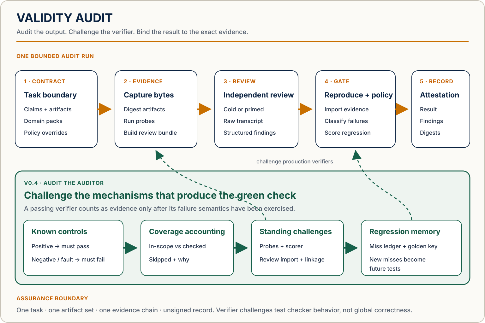

# Validity Audit

**A self-falsification protocol and reference runtime for bounded, evidence-backed claims about agent-produced work.**

Most evaluation systems ask whether the agent output passes a check. Validity Audit asks a second question too: **has the checker demonstrated that it can fail when it should?** v0.4.0 adds standing positive, negative, and fault controls around representative home-grown verifiers so a green result is less likely to be a silent fail-open.



Validity Audit does not certify an agent, model, organization, or workflow globally. It produces an **unsigned validity attestation for one task run over one digest-bound artifact set**. The record says what was claimed, what evidence was reviewed, what reproduced findings triggered policy, and which exact bytes the result covers.

The project exists because static evaluators decay. Builders miss their own assumptions; reviewers can hallucinate findings; public benchmarks get optimized against. Validity Audit combines independent review, reproduction gates, an accreting miss ledger, public-key regression tests, and standing verifier challenges so the evaluator can be challenged too.

> **Maturity:** v0.6.0 is the current release. It adds an optional deterministic fail-before / pass-after probe (FBPA, see below) that checks whether a claimed test actually fails at a `base` commit and passes at `head`. Because the probe can turn a previously accepted contract into a `fail`, it ships under a new policy identifier, `validity-audit-default-v0.6.0`; existing attestations keep their original identifier (see `CHANGELOG.md`). v0.5.0 introduced policy `validity-audit-default-v0.5.0`, which validates reviewer fields at landing time and changes some finalize outcomes relative to v0.3/v0.4 records; existing attestations from that era keep their original `validity-audit-default-v0.3.0` identifier. v0.4 added three standing challenge families: deterministic probes, public-key scorer denominator integrity, and review-import / claim-link integrity. Signing, provider adapters, API-key installation, and global agent certification are not available.

## Quickstart: reproduce the public golden case

These are the same install and execution commands used by the offline CI job:

```console
python -m pip install -e .
python golden_cases/self_contained/doc-bundle-01/run_case.py
```

The second command runs `prepare` and `finalize`, verifies the complete unsigned attestation, and scores the imported reviewer fixture against a frozen key. Its final line is:

```text
Golden case PASS: expected fail attestation and 1/1 regression score reproduced
```

The apparent contrast is intentional: the audit correctly returns a blocking `fail` for the planted artifact defect, while the benchmark passes because that expected finding was reproduced. The case uses no API key; CI also blocks outbound socket access during execution.

## What v0.4 challenges

A checker is not trusted merely because it printed PASS. The v0.4 protocol distinguishes:

| Control | Expected behavior |
|---|---|
| Positive | known-good input must pass |
| Negative | known-bad input must fail |
| Fault | broken, missing, or malformed input must hard-fail rather than become a clean pass |

Three representative standing challenge families exercise the real production paths in tests and CI:

1. **Deterministic probes** — readable artifacts pass; broken Markdown, missing artifacts, and invalid text fail closed. The same `run_probes` call also runs the optional FBPA sub-probe, described in "Deterministic fail-before / pass-after probe (FBPA)" below, when a contract declares `fail_before_pass_after`.
2. **Public-key scorer** — missing denominator-bearing fields are errors; explicit empty populations remain valid and distinct.
3. **Review import / claim linkage** — missing claim coverage, unknown finding links, and refuted claims without linked findings cannot produce a clean attestation.

This is deliberately not a claim that every verifier has been proven correct. The full contract, including skip accounting and its limits, is in [`protocol/VERIFIER_CHALLENGES.md`](protocol/VERIFIER_CHALLENGES.md).

## Run one audit

Create a JSON task contract that names one task, its bounded claims, repository-relative artifacts, domain packs, and any reason-bearing policy overrides. See [`schemas/examples/task_contract.json`](schemas/examples/task_contract.json) for a minimal example. Then prepare a fresh run directory:

```console
validity-audit prepare \
  --workspace . \
  --contract path/to/task_contract.json \
  --run-dir .validity-audit/runs/my-run \
  --review-context cold \
  --reviewer-kind human \
  --reviewer-label independent-reviewer \
  --operator-id local-operator
```

Give the emitted `review_bundle.json`—not the answer key or miss ledger—to an independent reviewer. Retain the raw transcript and collect JSON that validates against [`schemas/reviewer_output.schema.json`](schemas/reviewer_output.schema.json). Then finalize:

```console
validity-audit finalize \
  --workspace . \
  --run-dir .validity-audit/runs/my-run \
  --reviewer-output path/to/reviewer_output.json \
  --transcript path/to/raw_transcript.txt
```

`prepare` validates the contract, snapshots the exact artifact bytes, computes the digest chain, runs deterministic probes, and emits the provider-neutral review bundle. `finalize` refuses changed evidence, retains the raw transcript, imports findings without trusting reviewer-supplied policy results, applies the versioned policy, and writes:

- `attestation.json` — machine-readable unsigned attestation;
- `attestation.md` — human-readable report;
- `run_state.json` — durable lifecycle and evidence digests;
- an optional canonical receipt in `.validity-audit/attestations.jsonl`.

Every `prepare` requires a new or empty `--run-dir`. Equal inputs, ids, and timestamps produce equal digests in separate fresh directories; an existing evidence directory is never overwritten.

### Exit-code contract

| Code | Meaning |
|---:|---|
| `0` | prepare succeeded, or finalize produced `pass` / `pass_with_waiver` |
| `1` | invalid arguments, invalid input, or another operational error |
| `2` | finalize emitted a blocking `fail` attestation |
| `3` | finalize emitted a `needs_review` attestation |
| `4` | digest or provenance mismatch; no attestation emitted |

An unclassified `error_class` at finalize time -- and, independently, an unauthorized or
unresolved waiver target -- raises a policy error instead of landing an attestation: both
surface as exit code `1` with no attestation emitted, not as a `needs_review` disposition.

## What the output looks like

The human-readable report is deliberately short:

```markdown
# Unsigned Validity Attestation

- Task: `golden-doc-bundle-01`
- Status: **fail**
- Policy: `validity-audit-default-v0.6.0`

## Findings

- `incorrect-artifact-count` — **fail** — Details file overstates the audited artifact count

> This record is unsigned. It covers one task run and one artifact set;
> it does not certify an agent globally.
```

See the complete, schema-valid [`docs/attestation-example.json`](docs/attestation-example.json).

## Deterministic fail-before / pass-after probe (FBPA)

A claim that "this test proves the fix" is itself a checkable fact. FBPA checks it the only way a
deterministic tool can: it runs the claimed test against the commit before the change and against the
commit after it, under `git worktree` + pytest + JUnit XML, and records whether the result actually
depends on the change. It never calls an LLM. Full spec:
[`docs/specs/probe-fail-before-pass-after.md`](docs/specs/probe-fail-before-pass-after.md).

**What it proves:** that a specific claimed test fails at `base` and passes at `head` (spec §0).
**What it does not prove:** that the test targets the property the user actually cares about (a
fitness question, see `protocol/VERIFIER_CHALLENGES.md`, "What this does not prove"), and that the
test catches every bug of that kind — that is mutation testing, which FBPA is not and does not run
(spec §9, and see "Validated on this repository" below).

### The contract field

`fail_before_pass_after` is an optional task-contract field. If it is absent, the probe does not run
and the rest of the probe report is unchanged except for the `probe_version` string (spec §1.1). A
minimal example:

```json
"fail_before_pass_after": {
  "base": "<commit-ish>",
  "head": "<commit-ish>",
  "runner": "pytest",
  "test_paths": ["tests/**", "**/test_*.py", "**/conftest.py"],
  "claims": [
    {"test": "tests/test_policy.py::test_unknown_error_class_rejected", "intent": "fixes"}
  ],
  "auto_discover": false,
  "limits": {"memory_max": "2G", "timeout_s": 600, "repeats": 2}
}
```

### `fixes` versus `characterizes`

Each claim names a test and an intent:

- `intent: "fixes"` claims the test guards the bug the change fixes. It must fail at `base` and pass
  at `head`.
- `intent: "characterizes"` pins existing behavior (for example a PR that only adds tests). It must
  pass at `head`; passing at `base` too is expected and produces no finding. Without this distinction,
  every test-only PR would be reported as having a useless test.
- `auto_discover: true` treats test functions added or modified in the diff as `fixes` claims, for
  historical PRs that carry no contract.

### How verdicts map to policy

Condensed from spec §4 (`run_probes` findings reuse the existing policy pipeline; no new error class
was added):

| Verdict | Policy result |
|---|---|
| `demonstrated` (a `fixes` claim fails before, passes after) | no finding |
| `base_passes` (the test already passed at `base`) | **fail** |
| `head_not_passing` (the test does not pass at `head`) | **fail** |
| `absence_only` (the only reason it failed at `base` is a missing symbol) | advisory |
| inconclusive (collection/setup error, skip, or no implementation change) | **needs_review** |
| a fault, any `F_*` code (the probe itself could not measure) | effect none + **needs_review**, fail-closed, never a silent pass |

An auto-discovered test that lands anywhere but `demonstrated` also produces an advisory finding,
because an inferred claim is not the author's own claim that the test proves the fix.

### Environment requirement

Run the probe from an environment where this project cannot be imported from anywhere else. An
editable install of a different checkout (`pip install -e <other-checkout>`) is not caught by name
alone: its import finder can still serve a submodule the probed worktree itself lacks. That is a real
failure this repository hit during its own S2 validation (PR #5, spec §2 amendment 6): base was
missing `validity_audit/runtime.py`, the editable install at a different checkout served it silently,
and 36 tests "passed before" for the wrong reason. The probe's runtime module-origin audit (spec §2)
catches this at run time — it records every project module whose origin lies outside that run's
worktree and faults `F_ENV_IMPORT` for the claim — but a contaminated environment still makes every
affected claim fault, so running from a clean environment is the cheaper fix.

### Known limitations

(From spec §9.)

- Failing before only shows the test breaks when the fix is removed. It does not show the test
  catches **every** bug of that kind; that is mutation testing.
- `test_paths` decides what counts as the fix. A fix placed inside the test directory is treated as
  test code, and vice versa.
- Any non-absence exception at `base` counts as failing before (`B_FAIL_EXC`), including one close to
  an absence failure (for example a `TypeError` from a keyword argument `head` added).
- `F_ENV_IMPORT` requires a canary list. With none declared and none detectable, the probe faults
  rather than running without a canary.
- Existence checks (`hasattr`, `'N' in dir(x)`, and the other forms in spec §3.1) are recognized only
  in those forms; checks written via `__all__`, `inspect.getmembers`, `.keys()`, or a manual
  `if not hasattr(...)` are still judged `demonstrated`.
- A namespace package located (not imported) by the canary is checked by its first portion only; a
  later portion served from outside the worktree is recorded (`outside_portions`) but does not fault.
- Auto-discovery follows pytest's default collection names, not a repository's own `python_files` /
  `python_functions` / `python_classes` settings or non-`Test*` `unittest.TestCase` subclasses.
- A test that only asserts a constant (a version string, for example) is `demonstrated` when the
  constant changed — technically correct, and weak evidence.
- `repeats: 1` disables flake detection; the schema requires `repeats >= 2`.
- Absence attribution parses CPython's error-message wording; a Python release that rewords these
  messages degrades the attribution to `inconclusive:unattributed` (safe, but noisy).
- `B_ABSENT` relies on an AST check for symbol existence; a dynamically created symbol (`getattr`,
  module `__getattr__`) is misclassified as `B_FAIL_EXC`.

### Validated on this repository

FBPA was run with `auto_discover: true` against all 21 merged PRs in this repository's own history.
Generated table: [`docs/specs/fbpa-history-v0.5.0.md`](docs/specs/fbpa-history-v0.5.0.md). Hand
adjudication of every row: [`docs/specs/fbpa-history-adjudication-v0.5.0.md`](docs/specs/fbpa-history-adjudication-v0.5.0.md).

Across 135 claims: 34 `demonstrated`, 24 `base_passes`, 35 `absence_only`, 42 inconclusive, 0 faults.
Every `demonstrated` and `base_passes` row was read by hand against the PR diff. Two tests turned out
to be weak — they pass regardless of the bug they are supposed to guard: PR #10's single-line
Markdown-title check, and PR #1's duplicate-key check. PR #23 turned up a gap no test covers: a
mutation that removed the `pending_high_severity_unreproduced` condition from the policy's status
logic left the full suite at 174 passed. **That mutation check is not FBPA.** FBPA only compares one
commit to another along a claimed test; finding "which line, if deleted, leaves the suite green" is
mutation testing, and this repository does not run mutation testing as a standing check (spec §8, §9).

## Assurance layers

Validity Audit keeps different kinds of evidence separate rather than collapsing them into one score.

1. **Contract** — define the bounded claims, artifact set, domain packs, and policy overrides.
2. **Evidence** — snapshot exact artifact bytes, compute canonical digests, and run deterministic probes.
3. **Independent review** — provide a provider-neutral bundle to a human or model reviewer and retain the raw transcript.
4. **Reproduction and policy** — reproduced findings receive policy effects from versioned code, not from the reviewer.
5. **Attestation** — emit a machine-readable and human-readable unsigned record bound to the evidence chain.
6. **Verifier challenges** — exercise representative home-grown checkers with known-good, known-bad, and broken inputs so their own failure semantics are regression-tested.

## Review contexts and benchmark provenance

A `cold` review excludes answer keys, the miss ledger, and builder hint lists. A `primed` review records the sources used to prime the reviewer. Public golden cases are **regression evidence**, not fresh cold-review accuracy measurements: once the key is public, repeated success can demonstrate reproducibility and non-regression, but not independent recall.

Unexpected findings in public-key scoring are sent to adjudication rather than automatically counted as false positives. Accepted key changes require a new immutable key version.

## Default policy

The versioned `validity-audit-default-v0.3.0` policy remains the authority for v0.4 attestations; the release does not silently change v0.3 record semantics.

Starting with `validity-audit-default-v0.5.0`, several landing-time behaviors changed: see the
"Changed (breaking)" entry in [`CHANGELOG.md`](CHANGELOG.md) for the full list.

Starting with `validity-audit-default-v0.6.0`, the optional FBPA probe (see "Deterministic
fail-before / pass-after probe (FBPA)" above) can turn a previously accepted contract into a `fail`;
see the `[0.6.0]` "Changed (breaking)" entry in [`CHANGELOG.md`](CHANGELOG.md). The current
policy identifier in code is `validity-audit-default-v0.6.0`; `ERROR_CLASS_EFFECTS` itself (the table
below) is unchanged by this bump.

The current policy recognizes exactly these eight built-in error classes by default; any other
slug is an open slug and requires an explicit task-contract `policy_overrides` entry before a
reviewer can use it:

| Error class | Default gate effect |
|---|---|
| `correctness` | `fail` |
| `evidence_tampering` | `fail` |
| `fabrication` | `fail` |
| `fitness` | `advisory` |
| `leakage` | `fail` |
| `material_requirement_miss` | `fail` |
| `unauthorized_action` | `fail` |
| `maintainability` | `advisory` |

`other` or any other open slug not covered by `ERROR_CLASS_EFFECTS` or a contract
`policy_overrides` entry is rejected outright at finalize time: the run raises a policy error
listing the offending finding ids and the full legal class set, rather than silently landing as
`gate_effect: "none"`. A reason-bearing task-contract override can explicitly classify a slug as
`fail`, `advisory`, or `none`, which is how an open slug becomes acceptable. A non-reproduced
fail-class suspicion routes to `needs_review`. Independently of error class, a **high-severity**
finding that was never reproduced (`unreproduced`, `not_reproducible`, `not_attempted`) also routes
to `needs_review` even under an `advisory` class — a high-severity unknown must not pass through
silently as advisory. Lower-severity unreproduced advisory findings are unaffected and remain
`advisory`. A contract `policy_overrides` entry that explicitly classifies an open slug as
`gate_effect: "none"` does not exempt it from this rule either — a high-severity, unreproduced
finding still forces `needs_review` even under an explicit `none` override.

A waiver can change an active reproduced fail result only when it records issuer, reason, issue
time, expiry, and the original policy result; it never erases the underlying finding. A waiver
that names a `finding_id` this run never imported is rejected before issuer authorization runs.
A waiver's `issuer` label restricts which declared strings this version accepts — it is also
rejected unless that label appears in the task contract's `waiver_issuers` array, and any waiver
request against a contract that declares no `waiver_issuers` is rejected fail-closed. This
version does not authenticate issuer identity: attestations are unsigned, so `waiver_issuers`
is an allowlist of accepted labels, not a verified-credential check. Each of these waiver
rejections, like the unclassified-`error_class` rejection above, voids the entire `finalize`
run rather than only the one offending waiver or finding.

## Audit the auditor

The miss ledger is append-only and records newly discovered misses, severities, sources, and follow-up actions. The public golden case turns accepted misses into regression memory. v0.4 adds standing verifier challenges so selected checkers also have executable positive, negative, and fault controls.

The public `old-coder` issue and merged PR linked from [`protocol/VERIFIER_CHALLENGES.md`](protocol/VERIFIER_CHALLENGES.md) are a motivating external adoption case for the fail-open pattern, not validation of this project as a whole.

## Compatibility

The historical entry points remain available:

- `protocol/injected_bug_recall.py`
- `examples/self_contained/run_demo.py`
- `protocol/ledger.py`

They were guaranteed through all v0.3.x releases, with earliest removal v0.4.0. They remain present in v0.4.0 and v0.5.0 for migration convenience but are deprecated; new integrations should use the canonical package and benchmark paths.

## Scope limits

Validity Audit is intentionally bounded. It does not currently provide cryptographic signatures, hosted reviewer integrations, API-key management, a global trust score, or certification of an agent/model/organization. Verifier challenges demonstrate that selected checking mechanisms respond correctly to selected controls; they do not prove that the specification measures everything that matters.

## License

MIT.
